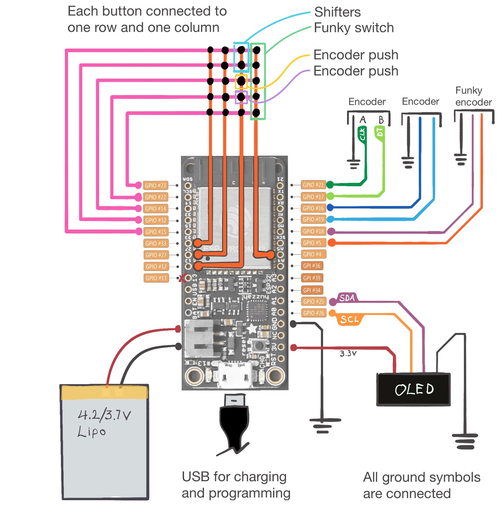

# Bluetooth Button Box

This is code that I run on a Huzzah32 Feather from Adafruit. It lives inside of the button box of my sim racing wheel. This gives me 3 encoders, a "funky switch", & 20+ buttons, all wirelessly. The Huzzah 32 ESP32 board has a BMS built in, and will charge the lithium cell whether the board is powered or not. I use a magnetic USB-Micro-B connector for quick connect and disconnect for charging. with ~1400 mAh in the cell I can get close to 24 hours of continuous on time.

* Originally forked from [Magnus Thome's implementation](https://github.com/MagnusThome/ESP32-BLE-Gamepad).
* Uses [John Main's code from www.best-microcontroller-projects.com](https://www.best-microcontroller-projects.com/rotary-encoder.html).
* Huzzah32 Battery Level code adapted from [Jon Froehlich's contrubution](https://github.com/makeabilitylab/arduino/commit/0b58c0b3b3194f50a81efa4008637b5f90e681fb).

## Parts List

* Micro controller [Adafruit HUZZAH32 – ESP32 Feather Board](https://www.adafruit.com/product/3405) (other ESP32 boards should work fine too)
* Ball spring detent encoders: [PEC11H-4020F-S0016](https://www.mouser.com/ProductDetail/652-PEC11H4020FS0016/) (most 6mm encoders will fit fine)
* Multi direction switch [RKJXT1F42001](https://www.mouser.com/ProductDetail/688-RKJXT1F42001/)  (funky switch)
* 12MM Tactile Switch 260GF 7.3MM [653-B3F-4155](https://www.mouser.com/ProductDetail/653-B3F-4155/) (I can't find the button caps)
* i2c display module [SSD1306 (128x32)](https://www.amazon.com/gp/product/B08L7QW7SR)
* 3.7V Lipo cell with JST PH 2-Pin connector.  
*CHECK POLARITY OF THE CONNECTOR!* De-pin and swap the connector's pins if necessary: [Adafruit](https://www.adafruit.com/product/2011) or [Amazon](https://www.amazon.com/gp/product/B08FD39Y5R)
* 3D printed parts in the [STL directory](./stl); you'll probably design your own enclosure though.
* Power switch (SPST). This is used to ground the `EN` pin which shuts off the 3.3V regulator but leaves the charging circuit powered.


### Prerequisites

* Install the Arduino IDE
* Install the board definitions for the ESP32
* Install the needed libraries (listed below)

```cpp
#include <Adafruit_GFX.h>     // https://github.com/adafruit/Adafruit-GFX-Library
#include <Adafruit_SSD1306.h> // https://github.com/adafruit/Adafruit_SSD1306
#include <ESP32Encoder.h>     // https://github.com/madhephaestus/ESP32Encoder/
#include <Keypad.h>           // https://github.com/Chris--A/Keypad
#include <BleGamepad.h>       // https://github.com/lemmingDev/ESP32-BLE-Gamepad
```


### Wiring



#### Button Matrix

You can use one button matrix for all of your push buttons, your shifters, and the encoder push function. Wiring it this way is more difficult/confusing than simply using one GPIO per button, but it's far more efficient (uses fewer pins).

**A note about Pin `13`** I was not able to use GPIO `13` for the button matrix (I was experiencing glitching in the matrix with all the other buttons). You may have more luck using it. I swapped the pin over to GPIO `4` afterwards.

There should be no reason you couldn't add more rows or columns to the matrix using GPI `36`, `39`, `34`, and GPIO `13`; if they are avaialble in your final wiring plan. I have not tested this.

#### Power Switch

You have two options. You can either connect your switch between `EN` and `GND` or you can just add the switch between the positive lead of your Lipo cell. Using the `EN` pin is easier, but there could be reasons you want to switch it at the power source. This is up to you.

#### Encoders

There should be no reason you couldn't add two more encoders to the layout (if you wanted to) using GPI `36`, `39`, `34`, and GPIO `13`; if they are avaialble in your final wiring plan. I have not tested this.

#### OLED Screen & Custom i2c Pins

I adde the OLED screen after the encoders and buttons were already mapped & built. At the time I had no idea I would have wanted to add an i2c device, so I used the Huzzah's default i2c pins for the button matrix (GPIOs `22` & `23`). With the ESP 32, you can just re-assign these in the `Wire.begin()`, so in the provided code, I have assinged them to GPIOs `25` & `26`.

```cpp
// Custom i2c pins and address for Adafruit OLED library
Wire.begin(CUSTOM_I2C_SDA, CUSTOM_I2C_SCL, SCREEN_ADDRESS);
```

-----

### Board Settings

These are my VS Code settings for interfacing with the board (your port will be different):
```json
{
    "port": "COM6", // find your Port and use it here
    "board": "esp32:esp32:featheresp32",
    "configuration": "FlashFreq=80,UploadSpeed=921600,DebugLevel=none,PartitionScheme=default",
    "sketch": "ble_button_box.ino",
    "output": "../build"
}
```

### Button Matrix

I'm not using any diodes, but you can implement them if you need to. I am using a 5x4 matrix for a total of 20 buttons:

```cpp
#define ROWS 5
#define COLS 4
uint8_t rowPins[ROWS] = {15, 32, 14, 22, 23};
uint8_t colPins[COLS] = {4, 12, 27, 33};
```

* 5 buttons for the funky switch (4 directions and push)
* 2 buttons for shifters (microswitches)
* 2 buttons for the encoders (push)
* 11 face buttons (push)

You need to define the HID button numbers you want the matrix buttons to identify as. In my example I am just counting up from `1..20` (you can tell that I counted incorrectly and skipped `4` while starting from `0`; no matter).

```cpp
byte keymap[ROWS][COLS] = {
  { 0, 1, 2, 3},
  { 5, 6, 7, 8},
  { 9,10,11,12},
  {13,14,15,16},
  {17,18,19,20}
};
```

### Funky Switch Issues

A note about the funky switch; you may notice that I'm doing some strange stuff here:

```cpp
#define FUNKY_DIR_COUNT 4
#define FUNKY_DIR_HOLDOFF_TIME 300 // 0.3sec
unsigned long funkyDirectionLastHoldoff[4] = {0,0,0,0};
char funkyCenterCode = 0;
char funkyDirectionCodes[FUNKY_DIR_COUNT] = {13, 9, 5, 17};
bool handlingFunkySwitch = false;
```

The Alps funky switch presses the center push for every direction press; it's hardwired that way. In order to code around this, I am checking to see if one of the four directions is pressed (the funky switch ended up being the first column [`0`, `5`, `9`, `13`, `17`] in my wiring). The array defines the `up`, `left`, `right`, `down` directions and the code iterates through it all later on.

If one of the cardinal directions is being pressed, we send _only_ that button code and stop processing the matrix.

We also need to have a holdoff time implemented to prevent bouncing.

```cpp
// Loops through the funky switch directions and checks to see if the push is being triggered
// along with another direction. If it is, we will flag it for skipping the normal press
// routine. We also press the _intended_ direction only.
for (int i = 0; i < FUNKY_DIR_COUNT; i++) {
  // if center not handling press, try directions.
  if(customKeypad.findInList((char) funkyCenterCode) != -1 && customKeypad.findInList((char) funkyDirectionCodes[i]) != -1) {
    if(now - funkyDirectionLastHoldoff[i] > FUNKY_DIR_HOLDOFF_TIME) {
      pressKey((char) funkyDirectionCodes[i]);
      funkyDirectionLastHoldoff[i] = now; // last press send
    }
    if (funkyDirectionLastHoldoff[i]==0) funkyDirectionLastHoldoff[i] = 1;   // SAFEGUARD WRAP AROUND OF millis() (WHICH IS TO 0) SINCE holdoff[i]==0 HAS A SPECIAL MEANING ABOVE
    handlingFunkySwitch = true;
  }
}
```

I'm sure there's a more elegant way to handle this, but I'm just not seeing it.


### Encoders

You will need to assign pins and "buttons" for your encoders too!

```cpp
//////////////////////////////////////////////////
// John Main "Robust Rotary encoder" Setup
//////////////////////////////////////////////////
// The `PEC11H-4020F-S0016` encoders I used from the BOM are
// very noisy and cause issues and double counts when used
// with the ESP32Encoder library. John's code works well!
#define ENCODER_COUNT 2
uint8_t uppPin[ENCODER_COUNT] = {16, 18}; // A pins
uint8_t dwnPin[ENCODER_COUNT] = {19, 5};  // B pins
uint8_t encCount[ENCODER_COUNT] = {0, 0};
uint8_t encValue[ENCODER_COUNT] = {0, 0};
uint8_t encPrevNextCode[ENCODER_COUNT] = {0, 0};
uint16_t encStore[ENCODER_COUNT]= {0, 0};
uint8_t encoderUpp[ENCODER_COUNT] = {23,25}; // Up buttons
uint8_t encoderDwn[ENCODER_COUNT] = {24,26}; // Down buttons
static int8_t rotEncTable[] = {0,1,1,0,1,0,0,1,1,0,0,1,0,1,1,0};


//////////////////////////////////////////////////
// ESP32Encoder Setup
//////////////////////////////////////////////////
// The `RKJXT1F42001` encoder works really well with the
// ESP32Encoder library, and does not work very well with
// the implemented "Robust Rotary encoder" solution.
unsigned long funkyEncoderHoldoff = 0;
int32_t funkyEncoderPrevCenter = 0;
uint8_t funkyEncoderUppPin = 21; // A pin
uint8_t funkyEncoderDwnPin = 17; // B pin
uint8_t funkyEncoderUpp = 22; // Up button
uint8_t funkyEncoderDwn = 21; // Down button
#define FUNKY_HOLDOFF_TIME 30
ESP32Encoder funkyEncoder;
```

Here the encoders are listed as columns. In this example, `16`, `19` are one encoder, and `18`, `5` are another, etc.

Likewise, when the encoder attached to `16`, `19` is rolled up or down, it'll press the gamepad buttons: `23`, `24`. These can be assigned to whatever you need them to be.


### Battery Level

Battery voltage and percentage reading is implemented.

```cpp
getBatteryVoltage();
getBatteryPercent();
```

Currently it sends the percent reading to the Bluetooth host every 5 minutes. The display code will later be updated to display this upon a button press combination (or perhaps holding a specific button for a few seconds).

Depending on your board, cell, and multimeter, you may need to adjust the vRef value.
```cpp
const float vRef = 1.048; // should be 1.1V but may need to be calibrated
```